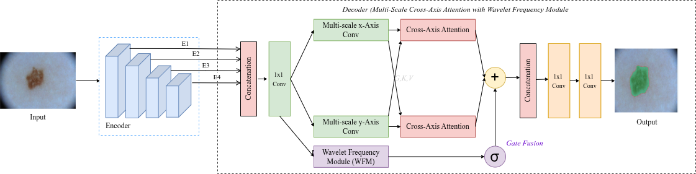
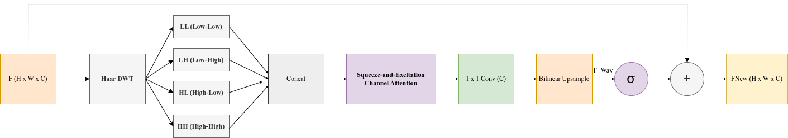
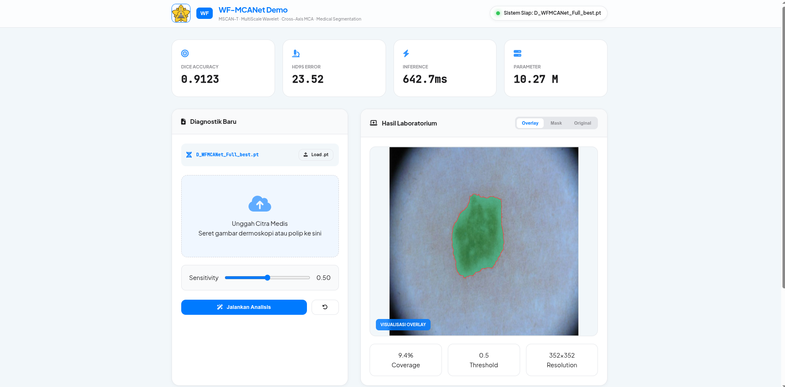
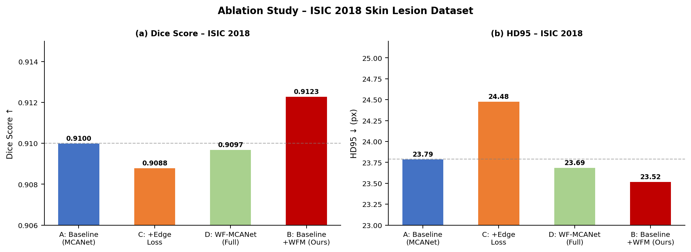
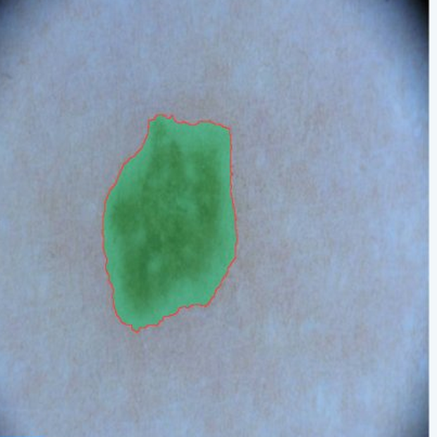
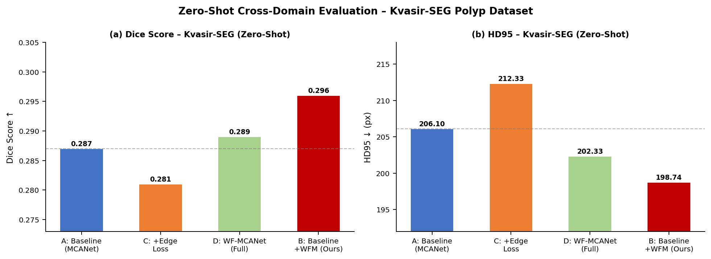

# WF-MCANet

### A Lightweight Wavelet Frequency Network with Cross-Axis Attention for Medical Image Segmentation

> Bringing frequency-domain edge evidence into a compact cross-axis attention decoder, so that lesion boundaries are delineated more precisely at almost no extra parameter cost.


**Authors:** Khairil Ilmi, Juwita · Department of Informatics, Universitas Syiah Kuala, Banda Aceh, Indonesia

---

## Overview

Most deep-learning segmentation models reason only in the spatial domain and never look at the
frequency content of an image, even though high-frequency components are exactly what encode
sharp lesion edges. **WF-MCANet** addresses this by inserting a **Wavelet Frequency Module (WFM)**
into the decoder of the lightweight MCANet framework. The WFM decomposes decoder features with a
Haar wavelet transform, reweights the resulting sub-bands with channel attention, and injects the
result back into the spatial stream through a **learnable gated fusion**.

The model is trained on the **ISIC 2018** skin-lesion dataset and additionally probed in a
**zero-shot** setting on the **Kvasir-SEG** polyp dataset (no retraining), using a boundary-focused
evaluation protocol built around the 95th-percentile Hausdorff Distance (HD95). The result is a
small but consistent boundary-accuracy gain that costs only **+0.20 M parameters** over the baseline,
which keeps the model deployable on modest clinical hardware.

---

## Highlights and Novelty

- **Wavelet Frequency Module (WFM)** placed *inside the decoder* rather than at the encoder input,
  so frequency-domain edge evidence is supplied directly to the attention-based decoder.
- **Haar wavelet decomposition** into four sub-bands: LL (Low–Low), LH (Low–High), HL (High–Low),
  and HH (High–High), with the diagonal HH band capturing edges that axis-aligned convolutions miss.
- **Squeeze-and-Excitation channel attention** across the wavelet sub-bands to emphasise the most
  informative frequency channels.
- **Learnable gated fusion** `F_new = F_spatial + σ(g) · Upsample(F_wav)` that controls how much of
  the frequency stream is injected, preventing noisy high-frequency artefacts from corrupting the
  spatial features.
- **Cross-axis multi-context attention decoder** inherited from MCANet for efficient global context.
- **HD95-oriented evaluation protocol** that reports worst-case boundary error, which is the value
  most relevant for surgical-margin planning, instead of relying on area-overlap metrics alone.
- **Cross-domain zero-shot analysis** (ISIC 2018 → Kvasir-SEG) to study whether frequency cues
  transfer across imaging modalities.
- **Lightweight by design**: the proposed configuration adds only **0.20 M parameters** (4.04 M → 4.24 M).

---

## Architecture

**Overall network.** A lightweight encoder produces multi-scale features that are decoded by
multi-scale cross-axis attention blocks. The deepest feature is passed through the WFM, whose output
is merged into the spatial stream by a learnable gate before the final segmentation head.



**Wavelet Frequency Module (WFM).** The input feature is decomposed by a Haar wavelet transform into
four sub-bands, concatenated, reweighted by Squeeze-and-Excitation channel attention, reduced by a
1×1 convolution, upsampled, and finally fused with the spatial feature through the learnable gate.



---

## Demo

A web-based demonstration application runs the final WF-MCANet checkpoint and shows the predicted
mask, overlay, lesion coverage, and inference time for an uploaded medical image.



---

## Results

### Skin-Lesion Segmentation — ISIC 2018 (ablation)

| Configuration                | WFM | Dice ↑     | HD95 (px) ↓ | Parameters |
| ---------------------------- | :-: | ---------- | ----------- | ---------- |
| Baseline (MCANet)            |  –  | 0.9100     | 23.79       | 4.04 M     |
| **Baseline + WFM (Ours)**    |  ✓  | **0.9123** | **23.52**   | 4.24 M     |
| Baseline + Edge Loss only    |  –  | 0.9088     | 24.48       | 4.04 M     |
| Full WF-MCANet (EffNet-B3)   |  ✓  | 0.9097     | 23.69       | 13.10 M    |

The improvement over the baseline is **small but consistent** (+0.0023 Dice, −0.27 px HD95) and is
obtained with only **+0.20 M parameters**. Two observations are worth noting: adding an edge-aware
loss *without* the WFM actually hurts both metrics, and the heavier EfficientNet-B3 variant does not
outperform the compact model, which points to better trainability of the lightweight design.



**Qualitative result.** Predicted lesion area (green overlay) and boundary (red contour) on a
dermoscopic image, produced by the demo application.

<p align="center">
  
</p>

### Cross-Domain Zero-Shot Analysis — Kvasir-SEG (no retraining)

The model is trained only on ISIC 2018 and applied directly to colonoscopic polyp images.

| Configuration                | Dice ↑    | HD95 (px) ↓ |
| ---------------------------- | --------- | ----------- |
| Baseline (MCANet)            | 0.287     | 206.10      |
| **Baseline + WFM (Ours)**    | **0.296** | **198.74**  |
| Baseline + Edge Loss only    | 0.281     | 212.33      |
| Full WF-MCANet (EffNet-B3)   | 0.289     | 202.33      |

> **Note (read honestly):** absolute scores are low here because of the large modality gap between
> dermoscopic and colonoscopic images, which is expected for a zero-shot transfer. This is an
> *exploratory generalization analysis*, not a claim of clinical-grade polyp segmentation. Within
> this setting, the WFM variant ranks first on both metrics, which suggests that the wavelet-encoded
> boundary geometry transfers better than purely spatial features.



### Evaluation Protocol

- **Dice** — area overlap between prediction and ground truth.
- **IoU** — alternative overlap measure.
- **HD95** — 95th percentile of the symmetric boundary distance; reports worst-case boundary error,
  which matters most for surgical-margin planning.

---

## Repository Structure

```text
.
├── train.py                  # training entry point
├── mscan_official.py         # MSCAN / encoder definition
├── app_demo
│   ├── app.py                # demo server
│   ├── model.py              # WF-MCANet model definition
│   ├── index.html            # demo web UI
│   ├── run_demo.sh           # launch script
│   ├── requirements.txt
│   └── checkpoints
│       └── D_WFMCANet_Full_best.pt   # trained checkpoint
├── assets                    # figures used in this README
│   ├── architecture_overall.png
│   ├── wfm_module.png
│   ├── results_ablation.png
│   ├── results_zeroshot.png
│   ├── qualitative_isic.png
│   └── demo.png
├── demo.png
└── README.md
```

---

## Trained Model

The repository ships with the final trained checkpoint:

```text
app_demo/checkpoints/D_WFMCANet_Full_best.pt
```

generated with `train.py`.

---

## Installation

```bash
git clone https://github.com/khairililmi2468gmailcom/wfmcanet.git
cd wfmcanet/app_demo
pip install -r requirements.txt
```

## Run the Demo

```bash
bash run_demo.sh
```

Then open:

```text
http://localhost:5000
```

## Usage

1. Launch the application.
2. Upload a dermoscopic (or polyp) image.
3. Click **Run Analysis**.
4. Inspect the output: segmentation mask, overlay visualization, coverage statistics, and inference time.

---

## Datasets

- **ISIC 2018** — skin-lesion segmentation: https://challenge.isic-archive.com/data/
- **Kvasir-SEG** — colorectal polyp segmentation (zero-shot only): https://datasets.simula.no/kvasir-seg/

---

## Citation

If you use WF-MCANet in your research, please cite:

```bibtex
@article{ilmi2026wfmcanet,
  title   = {A Lightweight Wavelet Frequency Network with Cross-Axis Attention for Medical Image Segmentation},
  author  = {Ilmi, Khairil and Juwita},
  year    = {2026},
  note    = {Manuscript under review}
}
```

---

## Authors

**Khairil Ilmi** — Master of Artificial Intelligence, Department of Informatics, Universitas Syiah Kuala, Banda Aceh, Indonesia
**Juwita** — Lecturer, Department of Informatics, Universitas Syiah Kuala, Banda Aceh, Indonesia

**Corresponding author:** Khairil Ilmi · khairililmi2468@gmail.com

---

## Acknowledgement

This work was conducted at the Department of Informatics, Universitas Syiah Kuala, Banda Aceh, Indonesia.

---

## License

Released for research and educational purposes.
